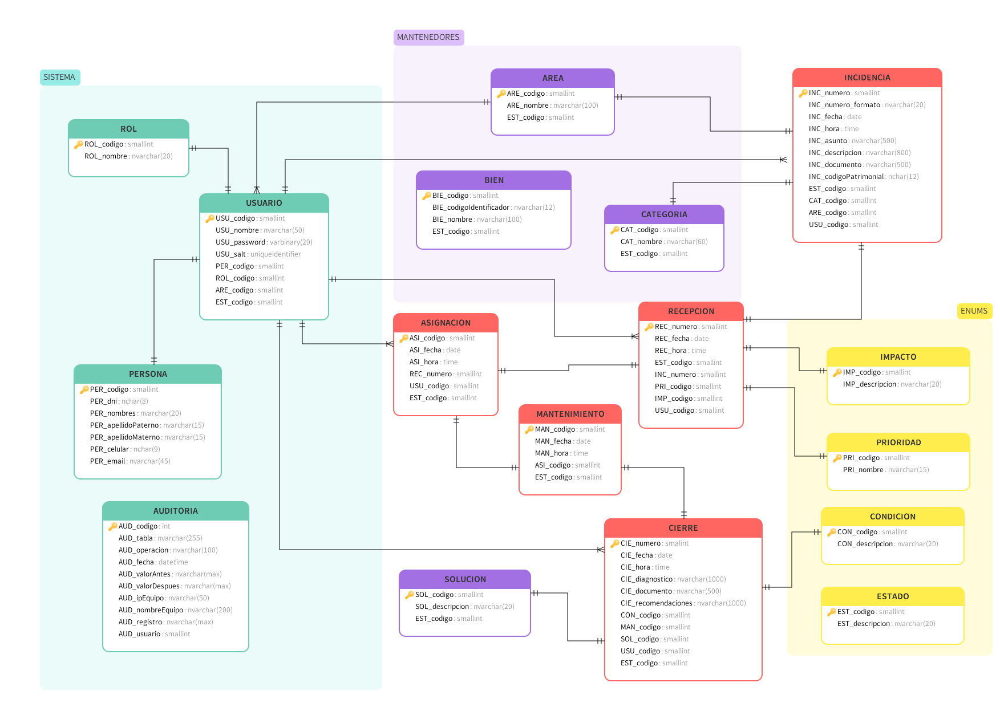

# 🧾 Base de Datos: Incidencias

Este proyecto contiene el modelo completo de la base de datos `incidencias`, diseñado para gestionar reportes, asignaciones, soluciones y auditoría de incidentes técnicos en una organización.

---

## 📚 Contenido del Repositorio

- `/sql/` - Scripts SQL para crear la base de datos y sus objetos.
- `/diagramas/` - Diagramas ERD u otros modelos visuales.
- `/data/` - Datos de prueba o cargas iniciales (opcional).
- `/docs/` - Documentación adicional (Diccionario de datos, modelo ER, etc.).


## ⚙️ Requisitos

- SQL Server 2008R2 o superior
- SQL Server Management Studio (SSMS) 
- Permisos para crear bases de datos

---

## 🛠️ Instalación

1. Clona este repositorio:

   ```bash
   https://github.com/GAMM95/incidencias_db.git
   cd incidencias-db/sql

Ejecuta los scripts (`SQL/scripts/`) en el siguiente orden:

-  `01_crear_base_datos.sql`
-  `02_crear_tablas.sql`
-  `03_vistas.sql`
-  `04_funciones.sql`
-  `05_procedimientos.sql`
-  `06_datos_prueba.sql` (opcional)

---

## 📑 Tablas principales
| Tabla           | Descripción                                       |
| --------------- | ------------------------------------------------- |
| `AREA`          | Áreas de soporte o atención                       |
| `ASIGNACION`    | Asignación de la incidencia a un usuario          |
| `AUDITORIA`     | Registro de auditoría de cambios                  |
| `BIEN`          | Bienes patrimoniales registrados                  |
| `CATEGORIA`     | Clasificación de incidencias                      |
| `CIERRE`        | Diagnóstico final, solución aplicada y cierre     |
| `CONDICION`     | Estado operativo del bien al finalizar            |
| `ESTADO`        | Estados del sistema (activo, en proceso, cerrado, etc) |
| `IMPACTO`       | Alcance o gravedad del problema reportado         |
| `INCIDENCIA`    | Reporte principal de un incidente                 |
| `MANTENIMIENTO` | Ejecución de trabajos correctivos                 |
| `PERSONA`       | Datos personales asociados a los usuarios         |
| `PRIORIDAD`     | Nivel de criticidad de la incidencia              |
| `RECEPCION`     | Registro de recepción, evaluación y prioridad     |
| `ROL`           | Roles de usuario (administrador, técnico, usuario)|
| `SOLUCION`      | Soluciones aplicadas a incidencias                |
| `USUARIO`       | Usuarios del sistema con credenciales y roles     |

---

## 👨‍💻 Diagrama ER

<p align="center">
  
</p>

---

## 📌 Convenciones
- Claves primarias: prefijo `PK_`, ej. PK_usuario
- Claves foráneas: prefijo `FK_<referencia>_<tabla>`, ej. FK_persona_usuario
- Campos `*_codigo` representan claves primarias o foráneas
- Campos de auditoría y seguridad:
  - USU_password (VARBINARY)
  - USU_salt (UNIQUEIDENTIFIER)
- Uso de NVARCHAR y NCHAR para soporte Unicode
- Campos `*_fecha` y `*_hora` se almacenan por separado (DATE y TIME)

---

## 📂 Auditoría
La tabla AUDITORIA almacena trazabilidad de operaciones:
- Tabla afectada
- Operación realizada (`INSERT, UPDATE, DELETE`)
- Fecha/hora de registro
- IP y nombre del equipo
- Valores antes/después
- Usuario que ejecutó el cambio

---

## 👨‍💻 Autor
Jhonatan Mantilla
- 📧 jhonatanmm.1995@gmail.com
- 🔗 https://github.com/GAMM95


<!-- https://markdownlivepreview.com/ --> 